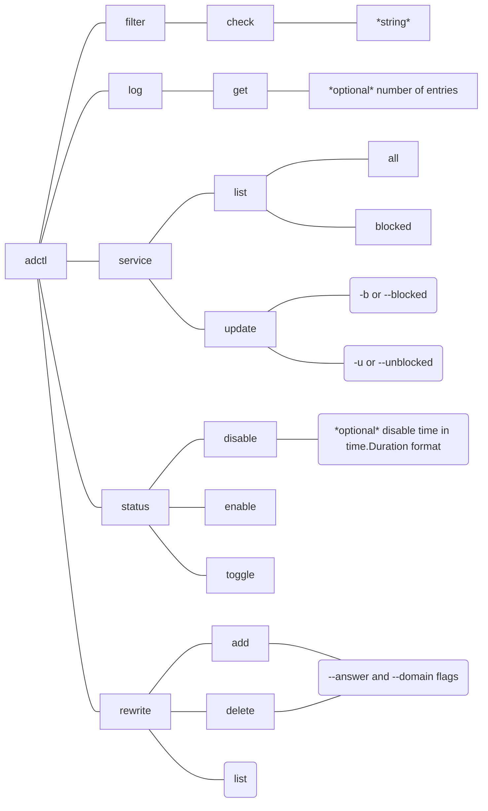

# adctl

`adctl` controls AdGuard Home.  [GitHub repo](https://github.com/ewosborne/adctl).

## Usage
    adctl [command]

    Available Commands:
    completion  Generate the autocompletion script for the specified shell
    filter      Check filter for entities
    help        Help about any command
    log         Get logs
    service     Alter filtered services
    status      Check and change adblocking status

    Flags:
    -d, --debug     Enable debug mode
    -h, --help      help for adctl
    -v, --version   version for adctl

    Use "adctl [command] --help" for more information about a command.

You need three environment variables: 

    ADCTL_USERNAME="<username you use to log into the AdGuard Home web UI>"
    ADCTL_PASSWORD="<password>"
    ADCTL_HOST="<host:port, e.g., router.example.com:8080>

The username and password are what you'd use to log into the AdGuard Home console. `ADCTL_HOST` is the host and port you use to reach the GUI.  Mine is set to `router:8080` but IP address will work too. AdGuard Home doesn't support auth tokens so hardcoded password is all you get. Also, the connection to the server is HTTP, not HTTPS, so your password is sent in cleartext. Use a unique password! 

I might add Viper support so `adctl` can get its config from a file, but right now env vars is all there is.

All output is json and suitable for piping to `jq` and `gron` and such. 

## Installing
Just grab the right binary for your platform and run it. No external dependencies.

## Building
You may want to build from scratch. I use [just](https://just.systems/) to manage building and testing so everything is in a `justfile`, and `goreleaser` so it gets a little complicated. [Check it out](justfile).

You can do that too, or you can just run`go build`.

## Testing
Almost all of my tests run against an AdGuard Home server, I don't have any fancy test harnesses or mocks or anything. YMMV but this approach works for me. They should work for you too.

## CLI

## Examples
See the CLI itself for all the options and usage, but here's the general idea.

### filter
Checks ad filters to see if a host is present.

    adctl filter check www.doubleclick.net

    {
    "reason": "FilteredBlackList",
    "rule": "||doubleclick.net^",
    "rules": [
        {
        "text": "||doubleclick.net^",
        "filter_list_id": 1732762628
        }
    ],
    "service_name": "",
    "cname": "",
    "ip_addrs": null,
    "filter_id": 1732762628
    }

### log
Pulls the last N logs (default is 500).  Takes an optional argument of the number of logs to get.  0 will fetch all logs on the server.

    adctl log get 
    {
    "data": [
        {
        "answer": [
            {
            "type": "A",
            "value": "34.203.97.10",
            "ttl": 60
        ...
        ...
    ],
    "oldest": "2024-12-13T14:50:29.166803105-05:00"
    }

### rewrite
Lists, adds, and deletes DNS rewrites. Three subcommands get you there: `list`, `add`, `delete`. Here's an example of all three, starting from an empty rewrite list.
**PLEASE NOTE**: this is beta stuff and not well tested. Also, the AdGuard Home API isn't very picky about what you send it, you can block a domain called 'foo bar' and return a result called 'bar baz' if you really want to. I haven't put much effort into making the CLI client smart.

`add` and `delete` take two flags, `--domain` and `--answer`.  These are just text fields I pass blindly on to AdGuard Home, so it should work the same as putting that text into the GUI.  I've seen some weird problems with quoting and escaping so if you're trying to get too clever with this, double check on the UI to make sure it's doing what you want.  But the basics work.

    erico@Erics-MacBook-Air ~ % adctl rewrite list
    []

    erico@Erics-MacBook-Air ~ % host www.example.io
    NAME       	TYPE	CLASS	TTL 	ADDRESS                       	NAMESERVER    	STATUS
    notcom.com.	SOA 	IN   	956s	brianna.ns.cloudflare.com.    	192.168.1.1:53	NXDOMAIN
                                        dns.cloudflare.com. 2359842202
                                        10000 2400 604800 1800

    erico@Erics-MacBook-Air ~ % adctl rewrite add --domain www.example.io --answer 192.168.1.1
    [
        {
            "answer": "192.168.1.1",
            "domain": "www.example.io"
        }
    ]

    erico@Erics-MacBook-Air ~ % adctl rewrite list
    [
        {
            "answer": "192.168.1.1",
            "domain": "www.example.io"
        }
    ]

    erico@Erics-MacBook-Air ~ % host www.example.io
    NAME           	TYPE	CLASS	TTL	ADDRESS    	NAMESERVER
    www.example.io.	A   	IN   	10s	192.168.1.1	192.168.1.1:53

    erico@Erics-MacBook-Air ~ % adctl rewrite delete --domain www.example.io --answer 192.168.1.1
    []

    erico@Erics-MacBook-Air ~ % host www.example.io
    NAME       	TYPE	CLASS	TTL 	ADDRESS                       	NAMESERVER    	STATUS
    notcom.com.	SOA 	IN   	926s	brianna.ns.cloudflare.com.    	192.168.1.1:53	NXDOMAIN
                                        dns.cloudflare.com. 2359842202
                                        10000 2400 604800 1800

The API also has an `update` method but it looks a little messy and I don't see much difference between an update and a delete/add so I don't plan to implement it unless I find a good reason.

### service
Shows and controls blocked services.
#### list
Doesn't do anything by itself but has two subcommands: `all` and `blocked`.

##### all
List all services known to AdGuard Home

    adctl service list all
    {
        "4chan": "4chan",
        "500px": "500px",
        "9GAG": "9gag",
        "Activision Blizzard": "activision_blizzard",
        "AliExpress": "aliexpress",
        ...
    }

##### blocked
List all currently blocked services.

    adctl service list blocked
    {
        "count": 1,
        "IDs": [
            "4chan"
        ]
    }

#### update
Takes two flags, `-b/--block` and `-u/--unblock`. Arguments are the ID of the service (the second item in the tuples returned by `service list all`) in the form of a CSV. Returns the equivalent of `adctl service list blocked`. `-u/--unblock` can also take the keyword `all` to disable all service blocking.  `-b/--block` cannot.

    adctl service update -b="yy,reddit" --unblock=4chan
    {
        "count": 2,
        "IDs": [
            "reddit",
            "yy"
        ]
    }

### status
Returns whether protection is enabled, and if it's disabled, whether there's a duration.

    adctl status
    {
        "Protection_enabled": true,
        "Protection_disabled_duration": ""
    }

#### disable
Disables protection. Takes an optional time parameter in [time.Duration](https://pkg.go.dev/time#ParseDuration) format.  

    adctl status disable
    {
        "Protection_enabled": false,
        "Protection_disabled_duration": ""
    }

    adctl status disable 2m30s
    {
        "Protection_enabled": false,
        "Protection_disabled_duration": "2m29s"
    }

#### enable
Enables protection.

    adctl status enable
    {
        "Protection_enabled": true,
        "Protection_disabled_duration": ""
    }

#### toggle
Toggles between protection enabled and disabled.

    adctl status
    {
        "Protection_enabled": true,
        "Protection_disabled_duration": ""
    }
    adctl status toggle
    {
        "Protection_enabled": false,
        "Protection_disabled_duration": ""
    }

    adctl status toggle 
    {
        "Protection_enabled": true,
        "Protection_disabled_duration": ""
    }

